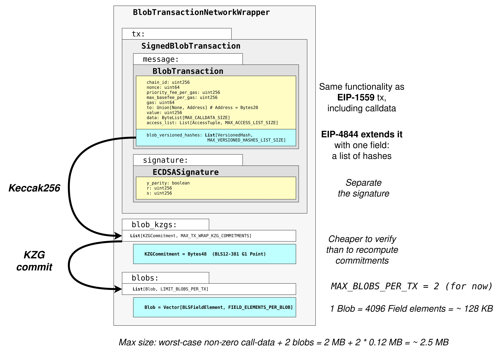

## Danksharding, EIP-4488 and EIP-4844

Danksharding is the full realization of the rollup scaling for Ethereum, turning it into a unified settlement and data availability layer. It was introduced as a part of Ethereum's rollup centric roadmap in 2020. 

The implementations planned as part of Danksharding are:
* PBS (proposer/builder separation), to avoid requiring individual validators to process 32 MB of data in one slot.
* Merged Free Markets
* Data Availability Sampling
* Blob Transaction
* Multi Dimensional Fee Market

These implementations are required to be in consensus-layer, and does not require any additional work from execution client.

> [!info]
> #### Sharding before Danksharding
> Sharding is splitting up the Ethereum blockchain so that subsets of validators are only responsible for a fraction of the total data. This was originally intended to be the way for Ethereum to scale. However, layer 2 rollups have developed much faster than expected and have provided a lot of scaling already, and will provide much more after Proto-Danksharding is implemented. This means "shard chains" are no longer needed and have been dropped from the roadmap.

> [!info]
> #### Why does Danksharding require Proposer Builder Seperation?
> 
> Proposer-builder separation is required to prevent individual validators from having to generate expensive commitments and proofs for 32MB of blob data. This would put too much strain on home stakers and require them to invest in more powerful hardware, which hurts decentralization. Instead, specialized block builders take responsibility for this expensive computational work. Then, they make their blocks available to block proposers to broadcast. The block proposer simply chooses the block that is most profitable. Anyone can verify the blobs cheaply and quickly, meaning any normal validator can check that the block builders are behaving honestly. This allows the large blobs to be processed without sacrificing decentralization. Misbehaving block builders could simply be ejected from the network and slashed - others will step into their place because block building is a profitable activity.

---
### EIP-4844 : Proto-Danksharding

Proto-Danksharding, also known as [EIP-4844(opens in a new tab)](https://eips.ethereum.org/EIPS/eip-4844), is a way for [rollups](https://ethereum.org/en/layer-2/#rollups) to add cheaper data to blocks. It is an intermediately step to make txns on L2s cheaper and scale ethereum for > 100,000 tps. 

> [!Info]
> 
> The name comes from the two researchers who proposed the idea: Protolambda and Dankrad Feist. Checkout conversation b/w Vitalik, Protolambda and Dankrad about Danksharding 
> https://www.youtube.com/watch?v=N5p0TB77flM

EIP-4844 introduces two main components to the Ethereum protocol: (1) a new transaction format for “blob-carrying transactions” and (2) a new _data gas_ fee market used to price this type of transactions. Before this, rollups had been limited in how cheap they can make user transactions by the fact that they post their transactions in `CALLDATA`.

Cons of CALLDATA:
* Data passed as CALLDATA lives on chain forever even though they are required only for a short period during fraud proof. 

Pros for BlobData:
* Data passed as a blobdata is not accessible to EVM execution and EVM can only view the commitment to the blob.
* At the node-level, the blobs of data are held in the consensus client.
* Blobs are extremely large (~125Kb) and much cheaper than CALLDATA as it is not competing for gas. 
* Data in blobs are temporary and are deleted approximately after 4096 epochs (18days ~ 2eeks)

>[!info]
>Calculation:
>- 1 epoch = 32 slots * 12 seconds = 384 seconds
>-  18 epochs = 18 * 384 seconds = 6,912 seconds

##### Why is it OK to add 1 MB data to blocks as Blobs that everyone has to download, but not to just make calldata 10x cheaper?
This has to do with the difference between **average load** and **worst-case load**. Today, we already have a situation where the average block size [is about 90 kB](https://etherscan.io/chart/blocksize) but the theoretical maximum possible block size (if _all_ 30M gas in a block went to calldata) is ~1.8 MB. The Ethereum network has handled blocks approaching the maximum in the past. However, if we simply reduced the calldata gas cost by 10x, then although the _average_ block size would increase to still-acceptable levels, the _worst case_ would become 18 MB, which is far too much for the Ethereum network to handle.

##### Why is it OK to delete Blob Data?
Rollups post commitments to their transaction data on-chain and also make the actual data available in data blobs. This means provers can check the commitments are valid or challenge data they think is wrong. At the node-level, the blobs of data are held in the consensus client. The consensus clients attest that they have seen the data and that it has been propagated around the network. If the data was kept forever, these clients would bloat and lead to large hardware requirements for running nodes. Instead, the data is automatically pruned from the node every 18 days. The consensus client attestations demonstrate that there was a sufficient opportunity for provers to verify the data. The actual data can be stored off-chain by rollup operators, users or others.

---
### EIP-4488

Before EIP-4844 there was another simpler attempt called EIP-4488. The purpose of EIP-4488 was to greatly decreases the gas cost of transaction CALLDATA and simultaneously caps total transaction CALLDATA in a block.

EIP-4488 did this with two simple rules:
- Calldata gas cost reduced from 16 gas per byte to 3 gas per byte
- A limit of 1 MB per block plus an extra 300 bytes per transaction (theoretical max: ~1.4 MB)

> [!info]
> #### Why there was a cap on max CALLDATA per block in EIP-4488?
> Today, the average block size [is 60-90 kB](https://etherscan.io/chart/blocksize), but the _maximum_ block size is `30M / 16 = 1,875,000` bytes (plus about a kilobyte of block and tx overhead). Simply decreasing the calldata gas cost from 16 to 3 would increase the maximum block size to 10M bytes. This would push the Ethereum p2p networking layer to unprecedented levels of strain and risk breaking the network; some previous live tests of ~500 kB blocks a few years ago had already taken down a few bootstrap nodes. So it was viable to cap it to 1.4 worst case block size while preventing most of the security risk.

---

#### Blob Transaction 

Proto-danksharding introduces a new transaction type called “blob-carrying transactions - Blob Transaction”

> [!info]
> #### **What Are Blobs (Binary Large Objects)?**
> Binary Large Objects (blobs) are a temporary store of data. Although new to the Ethereum network, blobs are already common in computer science. You can see them across programming languages like Javascript and Python.
> 
> Blobs are 4096 field-elements of 32 bytes each, with a long term maximum of 16 blobs per block. 4096 * 32 bytes * 16 per block = 2 MiB (One mebibyte equals 1.048576 megabytes) per block maximum. The blob cap per block can start low and grow over multiple network upgrades. Because validators and clients still have to download full blob contents, data bandwidth in proto-danksharding is targeted to 1 MB per slot. 

The new type of EIP-2718 transaction, “blob transaction”, essentially carry a validity proof which allows the Ethereum chain to verify their authenticity without reading the blob itself.

Some details about type-3 transactions and blobs:

- Each block can have up to 6 total blobs
- Each type-3 transaction can have 1 to 6 blobs
- Each blob stores up to 128kb of data. _If the entire 128kb is not used, the tx sender still pays for 128kb of blob space._
- Blobs are only required to be stored for 4096 epochs(~ 18 days).  This is considered available long enough for all actors of a L2 to retrieve, but short enough to keep disk use manageable. This allows blobs to be priced cheaper than calldata, which is stored forever

For blob transaction, the TransactionType is `BLOB_TX_TYPE` = `Bytes1(0x03)`. The fields `chain_id`, `nonce`, `max_priority_fee_per_gas`, `max_fee_per_gas`, `gas_limit`, `value`, `data`, and `access_list` follow the same semantics as EIP-1559.

The field `max_fee_per_blob_gas` is a `uint256` and the field `blob_versioned_hashes` represents a list of hash outputs from`kzg_to_versioned_hash`.

---

#### Multidimensional Fee Market

We essentially have a **dual market for transactions with standard transactions using the one-dimensional (1559) mechanism and blob transactions using the two-dimensional (1559 x 4844) mechanism**. This distinction is important because users can decide to use any of the two transaction types and there will be relevant interactions between the two markets.

 it is important to note that this is only a partial unbundling of the data resource. Standard transactions are still priced as before, with standard conversions for calldata of 16 gas units per byte and 4 units per empty byte. Only blob transactions use both markets with their EVM operations being priced in standard gas and their blob data being priced in data gas.

---

#### Sources
- https://ethereum.org/en/roadmap/danksharding/
- https://www.eip4844.com/
- https://eips.ethereum.org/EIPS/eip-4488
- https://eips.ethereum.org/EIPS/eip-4844
- https://www.blocknative.com/blog/eip-4844-blobs-and-blob-gas-what-you-need-to-know#2
- https://ethresear.ch/t/on-block-sizes-gas-limits-and-scalability/18444
- https://ethresear.ch/t/eip-4844-fee-market-analysis/15078
- https://ethresear.ch/t/blobs-reorgs-and-the-role-of-mev-boost/19783
- https://notes.ethereum.org/@dankrad/new_sharding
- https://medium.com/coinmonks/danksharding-a-revolutionary-update-of-the-ethereum-sharding-6b380e56a580
- https://www.youtube.com/watch?v=e9oudTr5BE4
- https://www.alchemy.com/overviews/danksharding
- https://dune.com/0xRob/blobs
- https://dune.com/ephema/eip-4844-the-impact-of-blobs
